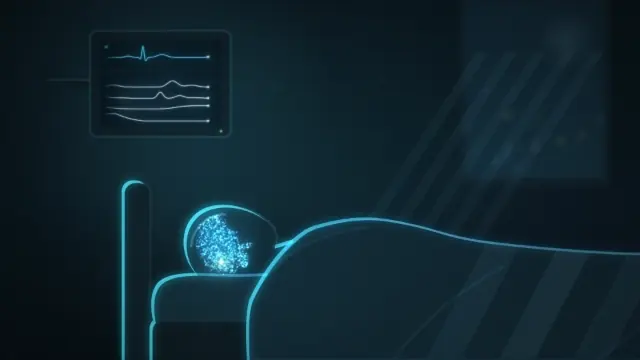
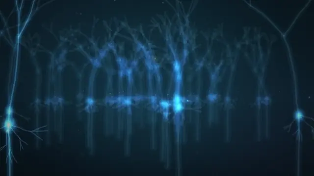
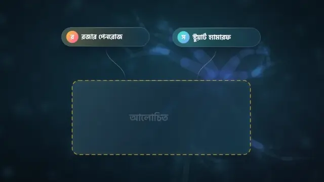
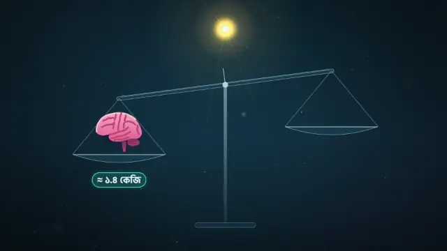

# Consciousness · চেতনা: the animation

  
  
  
  

<h3 align="center"><a href="https://raisulsohan.github.io/Consciousness-animation/">▶ Watch the whole film (4:08) in your browser</a></h3>

Click a clip to open its scene.

  <strong>An animated documentary film created, written, directed, and animated by <a href="https://raisulsohan.com">Raisul Sohan</a></strong>

The animation of *Consciousness* (চেতনা), the first science documentary for **[Bichitro Biggan](https://github.com/raisulsohan/BichitroBiggan)** (বিচিত্র বিজ্ঞান), conceived, written, and animated by **[Raisul Sohan](https://raisulsohan.com)**. Every frame is mathematically composed and drawn in JavaScript on an HTML5 canvas using his own procedural drawing code, and the film itself uses zero video or image files. The clips above are recordings of the pages. Each frame is a pure function of time, so any moment can be drawn on its own.

The pages play silently.

## Watch

**Online: https://raisulsohan.github.io/Consciousness-animation/**. Play the whole film or any completed scene, in 16:9 or 4:5.

Offline, open `index.html` or any page in a browser. No build step and no server are needed.

- `preview/` holds the whole film (`Consciousness_film_Desktop.html`, `Consciousness_film_Mobile.html`, 4:08) and the film scene by scene:
  `Consciousness_scene-NN_Desktop.html` (16:9, 1920×1080) and `Consciousness_scene-NN_Mobile.html` (4:5, 1080×1350).
- `scenes/scene-NN/` holds the scenes: `film.js` and `timing.js`.

Player keys: <kbd>Space</kbd> play/pause, <kbd>←</kbd>/<kbd>→</kbd> one frame, <kbd>Shift</kbd>+<kbd>←</kbd>/<kbd>→</kbd> one second, <kbd>Home</kbd> back to the start, <kbd>F</kbd> fullscreen. Add `?t=12.5` to a page's URL to freeze one frame.

## Completed Scenes

| Scene | Name | Time | Status |
|---|---|---|---|
| Scene 01 | The question (মৃত্যুর পর কি চেতনা থাকে?) | 0:00.0–0:36.0 | **FINAL** |
| Scene 02 | The neuron forest (মস্তিষ্ক ও নিউরন) | 0:36.0–0:52.3 | **FINAL** |
| Scene 03 | Physics and experience (পদার্থবিদ্যা ও ব্যক্তিগত অভিজ্ঞতা) | 0:52.3–1:13.3 | **FINAL** |
| Scene 04 | The quantum world (কোয়ান্টাম জগৎ) | 1:13.3–1:42.3 | **FINAL** |
| Scene 05 | Two claims (দুটি দাবি) | 1:42.3–2:03.2 | **FINAL** |
| Scene 06 | Orch-OR (অর্ক-ওআর তত্ত্ব) | 2:03.2–2:36.1 | **FINAL** |
| Scene 07 | The broken bridge (ভাঙা সেতু) | 2:36.1–3:10.3 | **FINAL** |
| Scene 08 | The scale of the brain (মস্তিষ্কের স্কেল) | 3:10.3–3:41.2 | **FINAL** |
| Scene 09 | The honest answer (অমীমাংসিত সত্য) | 3:41.2–4:08.8 | **FINAL** |

## Layout

| Path | What it is |
|---|---|
| `lib/engine.min.js` | bundled and minified animation engine and procedural vector runtime |
| `scenes/scene-NN/film.js` | the drawing code of one scene, in both 16:9 and 4:5 formats |
| `scenes/scene-NN/timing.js` | the scene's length and sentence timing marks |
| `preview/` | self-contained scene and full reel review pages |
| `media/` | animated preview recordings of key moments |

## Author & Credits

- **Creator, Animator & Director:** [Raisul Sohan](https://raisulsohan.com) ([@raisulsohan](https://github.com/raisulsohan))
- **Production:** Bichitro Biggan (Episode 01)
- **Animation & Engine:** Handcrafted by Raisul Sohan using procedural vector mathematics and HTML5 Canvas 2D drawing code.
